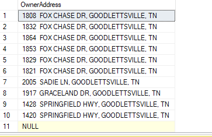

# Nashville Housing Data Cleaning


## Introduction
Data cleaning, also known as data cleansing, is the process of identifying and correcting or removing errors, inconsistencies, and inaccuracies in data. It is a critical step in the data analysis process that ensures that data is accurate, consistent, and usable for analysis.

The process of data cleaning can involve various tasks, such as:

1. **Removing duplicate data**: This involves identifying and removing any duplicated data entries in the dataset.

2. **Handling missing data**: This involves identifying missing data values and deciding on an appropriate strategy to handle them, such as imputing missing values or removing the entire observation.

3. **Correcting inconsistencies**: This involves identifying inconsistencies in data, such as data entry errors or data that does not conform to a specific format or standard.

4. **Standardizing data**: This involves converting data into a common format, unit of measure, or data type.

5. **Removing outliers**: This involves identifying data points that are significantly different from other data points and deciding on an appropriate strategy for dealing with them, such as removing them or transforming them.

6. **Validating data**: This involves checking the accuracy of data, such as ensuring that numerical data falls within a valid range.

Data cleaning is an iterative process and requires careful attention to detail to ensure that the resulting data is accurate and usable for analysis.

## About the dataset

The dataset contains Home value data for Nashville housing the capital city of U.S. state of Tennessee. The dataset contains 19 columns and 56,477 rows of data.

Click [here]() to download the dataset

## Metadata

- UniqueID : id number attributed to a buyer.
- ParcelID : code attributed to a property.
- LandUse : different uses of the land.
- PropertyAddress : address of the property
- SaleDate : date the property was sold
- SalesPrice : cost of the property
- LegalReference : citation is the practice of crediting and referring to authoritative documents and sources.
- SoldAsVacant : used to describe a situation in which property is vacant when it is sold so that the new owner can move in immediately
- OwnerName : name of property owner
- OwnerAddress : address of the owner
- Acreage : the size of an area of land in acres
- TaxDistrict : region or locality that assesses real estate taxes on the properties located within its borders
- LandValue : worth of the land
- BuildingValue : worth of a building
- TotalValue : landvalue + building value
- YearBuilt : year the building was built
- Bedrooms : number of bedrooms in the property
- FullBath : a bathroom that includes a shower, a bathtub, a sink, and a toilet.
- HalfBath : a half bathroom only contains a sink and a toilet.

Raw Data


## Tool

This project was carried out using Microsoft Sequel Server

## Data Cleaning

After downloading the dataset a database was created in sequel sever named **Nashville**, then imported the data using sequel sever import/export tool.

The following was discovered after exploring the dataset

- The SaleDate is not in the standard format.
- Some rows in the PropertyAddress column are NULL
- The PropertyAddress has both the City and House Address in the same column.
- The OwnerAddress has the state, city, and address in the same column.
- Some rows in the SoldAsVacant has Y and N instead of Yes or No.
- There are some duplicate rows that need to be removed.
- Some Columns would not be useful for the analysis and therefore should be deleted.
  
After cleaning the data, new columns were created in the table and updated with the cleaned data.

1. **Standardizing SaleDate** : The saledate is in the **TIMESTAMP** format which needs to be converted into **DATE** format. Using **CAST**, a function which converts the data type of an expression to the specified data type, the date column was coverted into the right format.

```
SELECT saledate, CAST(saledate as date) as SaleDate
from Housing


alter table housing
add SaleDateconverted date

update Housing
set SaleDateconverted= CAST(saledate as date)

```

 Before Cleaning                    |                   After Cleaning
:---------------------------------:|:---------------------------------:

               | 


2. **Populating The Missing Data In The PropertyAddress Column** : Some rows in the PropertyAddress column contains NULL values. On further exploration it was found that some rows have the same ParcelID, this set of rows have the same PropertyAddress. I populated the NULL values with the PropertyAddress of the same ParcelID. A self join of the ParcelID column was done to get the address of rows with the same ParcelID and used the **ISNULL** function to replace the NULL values.

```
SELECT a. [UniqueID ], a.PropertyAddress, b.[UniqueID ], b.PropertyAddress, ISNULL(a.propertyaddress, b.PropertyAddress)
FROM Housing a
JOIN Housing b
 ON a.ParcelID = b.ParcelID
 AND a.[UniqueID ] <> b.[UniqueID ]
WHERE a.PropertyAddress IS NULL


UPDATE a
SET PropertyAddress = ISNULL(a.propertyaddress, b.PropertyAddress)
FROM Housing a

```

3. **Breaking Out PropertyAddress Into Individual Columns** : To break out the property address into individual column the **SUBSTRING** and **CHARINDEX** function was used. This two functions enables the extraction of character from a text possible no matter where the delimiter is. **SUBSTRING** function extracts the substring from the specified string based on the specified location while **CHARINDEX** function returns the substring position inside the specified string. Using this two functions I was able to break apart the property address column .

```
SELECT
SUBSTRING(propertyaddress,1, CHARINDEX(',', propertyaddress)- 1) as Address,
SUBSTRING(propertyaddress, CHARINDEX(',', propertyaddress) +1, LEN(PropertyAddress)) as Address
from Housing


Alter table Housing
add PropertySplitAddress nvarchar(255);

update Housing
set PropertySplitAddress = SUBSTRING(propertyaddress,1, charindex(',', propertyaddress)- 1)


Alter table Housing
add PropertySplitCity nvarchar(255);

update Housing
set PropertySplitCity = SUBSTRING(propertyaddress, CHARINDEX(',', propertyaddress) +1, LEN(PropertyAddress))

```

Before Cleaning                                 |                               After Cleaning
:----------------------------------------------:|:--------------------------------------------:

                     |  


4. **Splitting OwnerAddress Into (Address, city and State)** : Instead of using **SUBSTRING** and **CHARINDEX** to split the column  a different function was used **PARSENAME**. The **PARSENAME** function returns the specified part of an object name. This function uses period (.) as the delimiter, I replaced the comma in the OwnerAddress column with period before splitting.

```
SELECT
PARSENAME(replace(owneraddress, ',', '.'), 3),
PARSENAME(replace(owneraddress, ',', '.'), 2),
PARSENAME(replace(owneraddress, ',', '.'), 1)
FROM Housing


alter table Housing
add OwnerSplitAddress nvarchar(255)

update Housing
set OwnerSplitAddress = PARSENAME(replace(owneraddress, ',', '.'), 3)


alter table Housing
add OwnerSplitCity nvarchar(255)


update Housing
set OwnerSplitCity =PARSENAME(replace(owneraddress, ',', '.'), 2) 


alter table Housing
add OwnerSplitState nvarchar(255)


update Housing
set OwnerSplitState = PARSENAME(replace(owneraddress, ',', '.'), 1)

```

Before Cleaning                                    |                                After Cleaning
:-------------------------------------------------:|:---------------------------------------------:

                           |                  


5. **Changing Y To Yes and N To No In SoldAsVacant column** : Here the **CASE** function to clean up the column. The **CASE** statement is like the **IF** statement in other programming languages. The case statement in SQL returns a value on a specified condition.

```
SELECT
CASE WHEN SoldAsVacant = 'Y' THEN 'Yes'
 WHEN SoldAsVacant = 'N' THEN 'No'
 ELSE SoldAsVacant
 END AS SoldAsVacant
FROM housing


update Housing
SET SoldAsVacant = CASE WHEN SoldAsVacant = 'Y' THEN 'Yes'
 WHEN SoldAsVacant = 'N'THEN 'No'
 ELSE SoldAsVacant
 END

```

Before Cleaning                                   |                      After Cleaning
:------------------------------------------------:|:-----------------------------------:

                         |      


6. **Removing Duplicates** : Duplicate records are identical rows in a table. There are several ways to check for duplicates in a table, here a CTE was used in conjunction with the ROW_NUMBER window function to find the duplicates in the table. After locating the duplicates it was deleted from the table.

```
WITH RownumberCTE as (
select *,
ROW_NUMBER() over (partition by 
parcelid, propertyaddress, saleprice, saledate, legalreference order by uniqueid) as Row_num
from Housing) 

--select [UniqueID ] ,ParcelID, Row_num
--from RownumberCTE
--where Row_num > 1
--order by PropertyAddress

delete
from RownumberCTE
where Row_num > 1

```


7. **Deleting Unused Columns** : After cleaning up the table the columns that are not useful are deleted

```
Alter table Housing
Drop Column Propertyaddress, Saledate, Owneraddress, Taxdistrict

```

Working on this project helps to solidifies the skills I have acquired on SQL so far, being able to combine various SQL functions to create complex queries


